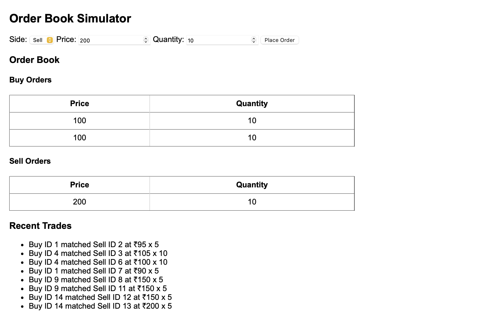

# 🧮 Order Book Simulator

A real-time stock exchange order book simulator built with Flask and Socket.IO.  
It matches buy and sell orders using price-time priority, simulating a simplified version of how actual trading platforms work.

---

## 🔧 Tech Stack

- **Backend:** Python, Flask, Flask-SocketIO
- **Frontend:** HTML, JavaScript, CSS
- **Data Structures:** Max Heap / Min Heap (via `heapq`) for efficient order matching

---
## ScreenShot:


---

## 🎯 Features

- Submit Buy or Sell orders via a simple web form
- Matching engine uses **price-time priority**
- Live order book shows open Buy/Sell orders
- Matched trades shown in real time using WebSockets
- Clean, minimal UI for testing trade flows

---

## 💻 Local Setup

```bash
git clone https://github.com/Anish30Arora/order-book-simulator.git
cd order-book-simulator
python3 -m venv ordbookvirt
source ordbookvirt/bin/activate
pip install -r requirements.txt
python app.py


