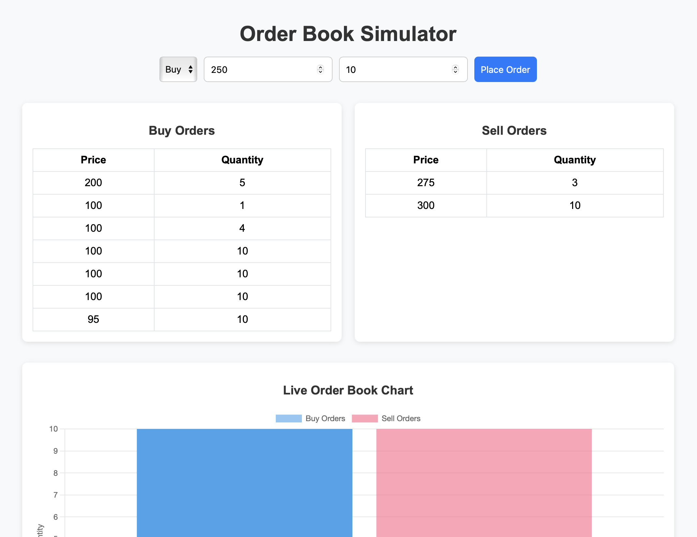
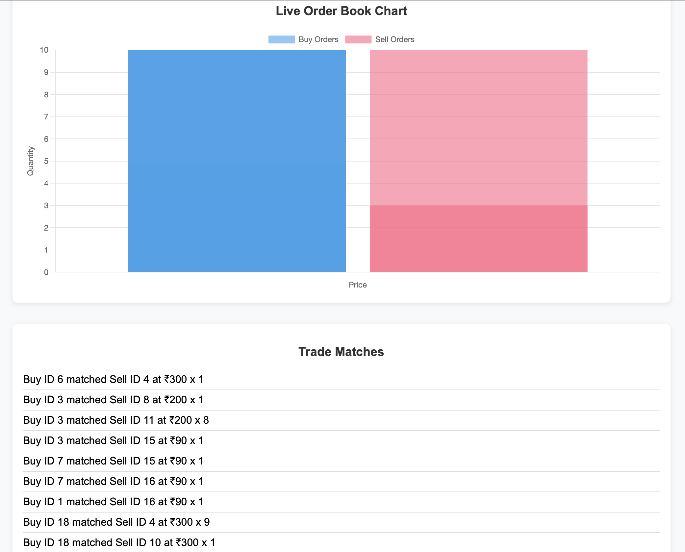

# 🧮 Order Book Simulator & Visualizer

A real-time stock exchange order book simulator built with **Flask** and **Socket.IO**, now enhanced with **chart-based visualization** for live buy/sell data trends.

This project simulates the matching of buy and sell orders using **price-time priority**, replicating core logic used in real-world trading platforms.

---

## 🔧 Tech Stack

- **Backend:** Python, Flask, Flask-SocketIO
- **Frontend:** HTML, JavaScript, CSS
- **Visualization:** Chart.js
- **Data Structures:** Max Heap / Min Heap (using `heapq`) for fast order matching

---

## 📸 Screenshot




---

## ⚙️ Features

✅ Submit Buy or Sell orders via a user-friendly web interface  
✅ Matching engine follows **price-time priority** logic  
✅ Live updating **Order Book Table** for Buy and Sell sides  
✅ Real-time **Trade Notifications**  
✅ 📈 New: **Live Chart** to visualize current Buy/Sell depth  
✅ Lightweight, responsive, and clean UI  

---

## 📊 Chart Demonstration

Visualizes buy and sell order volumes at various price points using **Chart.js**.  
This gives an intuitive snapshot of market depth and sentiment.

---

## 🚀 Local Setup Instructions

```bash

git clone https://github.com/Anish30Arora/order-book-simulator.git
cd order-book-simulator
python3 -m venv ordbookvirt
source ordbookvirt/bin/activate 
pip install -r requirements.txt
python app.py


